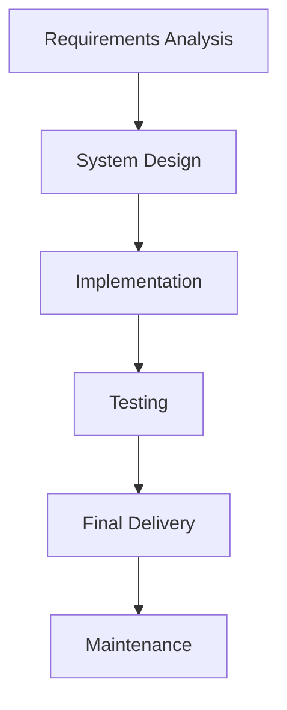
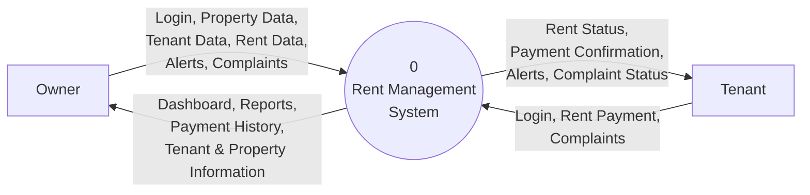
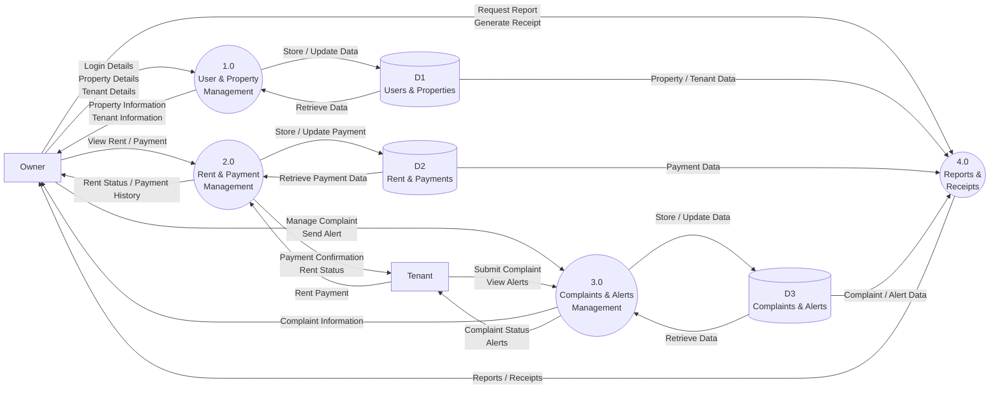

# 🏠 Rent Management System (RMS)

A simple web-based **Rent Management System** developed as an academic Software Engineering project. The system is designed to simplify the management of rental properties, tenants, rent payments, complaints, alerts and payment records.

The project is being developed by a **two-member team** and is intended to run locally on a personal computer. The frontend is being developed using **HTML, CSS and Vanilla JavaScript**. Backend and database integration using PHP and MySQL will be implemented in a later phase.

---

## 📌 Table of Contents

* [Project Overview](#-project-overview)
* [Problem Statement](#-problem-statement)
* [Objectives](#-objectives)
* [Project Scope](#-project-scope)
* [Users of the System](#-users-of-the-system)
* [Functional Requirements](#-functional-requirements)
* [Non-Functional Requirements](#-non-functional-requirements)
* [Software Process Model](#-software-process-model)
* [Development Plan](#-development-plan)
* [System Modules](#-system-modules)
* [Data Flow Diagram](#-data-flow-diagram)
* [Level 0 DFD](#level-0-dfd-context-diagram)
* [Level 1 DFD](#level-1-dfd)
* [System Architecture](#-system-architecture)
* [Database Planning](#-database-planning)
* [Technology Stack](#-technology-stack)
* [Project Structure](#-project-structure)
* [User Workflow](#-user-workflow)
* [Testing Plan](#-testing-plan)
* [Current Development Status](#-current-development-status)
* [Future Enhancements](#-future-enhancements)
* [Limitations](#-limitations)
* [Team](#-team)

---

# 📖 Project Overview

The **Rent Management System (RMS)** is a software application designed to help property owners manage rental properties and tenants from a single system.

The system has two main users:

* **Owner**
* **Tenant**

The Owner can manage properties and tenants, monitor rent collection, view payment history, generate payment receipts, manage complaints, send alerts and view reports.

The Tenant can view rental information, check rent status, make simulated rent payments, view payment history, submit complaints and receive alerts.

The project is being developed as a **small-scale academic application** rather than a production-level commercial system.

---

# ❗ Problem Statement

Managing rental properties manually can become difficult when the number of properties and tenants increases. Owners may need to maintain separate records for tenants, rent payments, complaints and property information.

Manual management can result in:

* Difficulty tracking rent payments
* Loss or duplication of records
* Difficulty identifying pending payments
* Poor complaint tracking
* Difficulty maintaining tenant information
* Time-consuming report generation
* Lack of centralized information

The Rent Management System aims to provide a simple centralized system for managing these activities.

---

# 🎯 Objectives

The main objectives of the project are:

1. To provide a centralized system for managing rental properties.
2. To maintain tenant information digitally.
3. To help owners track rent collection and payment history.
4. To allow tenants to view their rent information.
5. To provide a simple mechanism for submitting and managing complaints.
6. To allow owners to send alerts to tenants.
7. To generate basic reports and payment receipts.
8. To provide separate access for Owners and Tenants.
9. To reduce the dependency on manual rental records.
10. To demonstrate the practical application of Software Engineering concepts.

---

# 📌 Project Scope

## In Scope

The following features are included in the planned system:

### Owner

* Owner login
* Dashboard
* Property management
* Tenant management
* Rent collection
* Payment history
* Payment receipt generation
* Reports
* Complaint management
* Alerts/notifications
* Settings
* Logout

### Tenant

* Tenant login
* Tenant dashboard
* View rental information
* View rent status
* Simulated rent payment
* Payment history
* Submit complaints
* View complaint status
* View alerts
* Profile information
* Logout

### Common

* Landing page
* Role-based login
* Responsive user interface
* Local data management during frontend development

---

# 👥 Users of the System

## 1. Owner

The Owner is responsible for managing the rental properties and tenants.

The Owner can:

* Add and manage properties
* Add and manage tenants
* Monitor rent collection
* View payment history
* Generate receipts
* View reports
* Manage complaints
* Send alerts
* Manage account settings

## 2. Tenant

The Tenant uses the system to access their rental information.

The Tenant can:

* View rental information
* View current rent
* Make a simulated rent payment
* View payment history
* Submit complaints
* View complaint status
* View alerts

---

# 📝 Functional Requirements

Functional requirements describe what the system should do.

## FR-01: User Authentication

The system shall allow Owners and Tenants to log in using their respective credentials.

## FR-02: Owner Dashboard

The system shall provide the Owner with an overview of:

* Total properties
* Total rooms
* Occupied rooms
* Vacant rooms
* Active tenants
* Total rent collection
* Pending rent
* Recent payments
* Recent complaints

## FR-03: Property Management

The Owner shall be able to:

* Add a property
* View properties
* Edit property information
* Delete/deactivate a property
* View property details
* View room occupancy

## FR-04: Tenant Management

The Owner shall be able to:

* Add tenants
* View tenant details
* Edit tenant information
* Remove/deactivate tenants
* Assign tenants to properties and rooms

## FR-05: Rent Collection

The system shall allow the Owner to:

* View rent due
* View paid rent
* View pending rent
* Record rent payments
* Filter rent records

## FR-06: Payment History

The system shall maintain payment records containing information such as:

* Tenant
* Property
* Amount
* Date
* Payment status

## FR-07: Payment Receipt

The Owner shall be able to generate and print a payment receipt.

## FR-08: Complaint Management

Tenants shall be able to submit complaints.

Owners shall be able to:

* View complaints
* Update complaint status
* Respond to complaints

## FR-09: Alerts

Owners shall be able to send alerts to tenants.

Tenants shall be able to view received alerts.

## FR-10: Reports

The Owner shall be able to view basic reports related to:

* Rent collection
* Pending rent
* Property occupancy
* Payment history

## FR-11: Tenant Rent Payment

The Tenant shall be able to perform a simulated rent payment.

> Real payment gateway integration is outside the scope of the current academic project.

---

# ⚙️ Non-Functional Requirements

## Usability

The system should provide a simple and understandable interface for both Owners and Tenants.

## Performance

The system should respond quickly during normal local usage.

## Reliability

The system should maintain consistent rental and payment records and handle invalid input appropriately.

## Security

The system should provide separate access for Owner and Tenant roles.

In the future backend implementation, passwords should be securely stored rather than stored as plain text.

## Maintainability

The project should use an organized folder structure and separate HTML, CSS and JavaScript files.

## Compatibility

The system should work on commonly used modern browsers such as:

* Google Chrome
* Microsoft Edge
* Mozilla Firefox

---

# 🔄 Software Process Model

## Selected Model: Waterfall Model

The **Waterfall Model** has been selected for this project because RMS is a small-scale academic project with relatively well-defined requirements.

The major requirements can be identified and documented before implementation, allowing the project to proceed through sequential development phases.

### Waterfall Phases



### 1. Requirements Analysis

Identify:

* Users
* System objectives
* Functional requirements
* Non-functional requirements
* Project scope
* Constraints

### 2. System Design

Prepare:

* System architecture
* DFD
* Database planning
* User interface design
* Module structure
* Navigation structure

### 3. Implementation

The frontend is implemented using:

* HTML
* CSS
* Vanilla JavaScript

Backend implementation using PHP and MySQL will be performed later.

### 4. Testing

The system will be tested to verify:

* Login functionality
* Navigation
* Forms
* Property management
* Tenant management
* Rent management
* Payment records
* Complaints
* Alerts
* Reports

### 5. Final Delivery

The completed local application will be demonstrated as the final academic project.

### 6. Maintenance

After testing, necessary bug fixes and minor improvements can be performed.

---

# 📅 Development Plan

The project follows the Waterfall process and can be planned as follows:

| Phase           | Main Activities                          | Status                  |
| --------------- | ---------------------------------------- | ----------------------- |
| Requirements    | Requirements gathering and documentation | ✅ Completed             |
| System Design   | DFD, module planning, UI planning        | ✅ In Progress/Completed |
| Frontend Design | HTML/CSS/JS interface                    | ✅ Almost Completed      |
| Backend         | PHP implementation                       | ⏳ Planned               |
| Database        | MySQL database integration               | ⏳ Planned               |
| Integration     | Connect frontend with backend/database   | ⏳ Planned               |
| Testing         | Functional and system testing            | ⏳ Planned               |
| Final Delivery  | Final local application                  | ⏳ Planned               |

---

# 🧩 System Modules

The RMS is divided into the following major modules.

## Owner Modules

### Dashboard

Provides an overview of properties, rooms, tenants, rent collection and recent activities.

### Property Management

Manages rental properties and room occupancy.

### Tenant Management

Maintains tenant information and property/room assignments.

### Rent Collection

Tracks rent payments and pending rent.

### Payment History

Stores and displays previous payment records.

### Reports

Provides basic rental and payment reports.

### Complaints

Allows the Owner to manage tenant complaints.

### Alerts

Allows the Owner to send alerts to tenants.

### Settings

Provides basic profile and application settings.

---

## Tenant Modules

### Tenant Dashboard

Provides an overview of the tenant's rental information.

### Rent Payment

Allows simulated rent payment.

### Payment History

Displays previous payments.

### Complaints

Allows tenants to submit complaints and view their status.

### Alerts

Displays alerts sent by the Owner.

### Profile

Displays basic tenant information.

---

# 📊 Data Flow Diagram

The Data Flow Diagram represents how information moves between external users, system processes and data stores.

The project uses:

* **Rectangle** → External Entity
* **Circle** → Process
* **Parallel Lines** → Data Store
* **Arrow** → Data Flow

The two external entities are:

* Owner
* Tenant

---

# Level 0 DFD — Context Diagram

At Level 0, the complete RMS is represented as a single process.



### Level 0 Explanation

The Owner sends management-related information to RMS and receives property, tenant, payment and report information.

The Tenant sends login, payment and complaint information to RMS and receives rent status, payment confirmation, alerts and complaint status.

---

# Level 1 DFD

At Level 1, the RMS is divided into four major processes:

1. **1.0 User & Property Management**
2. **2.0 Rent & Payment Management**
3. **3.0 Complaints & Alerts Management**
4. **4.0 Reports & Receipts**

The main data stores are:

* **D1 — Users & Properties**
* **D2 — Rent & Payments**
* **D3 — Complaints & Alerts**



### Level 1 Process Description

| Process                                | Description                           | Main Data Store |
| -------------------------------------- | ------------------------------------- | --------------- |
| **1.0 User & Property Management**     | Handles users, properties and tenants | D1              |
| **2.0 Rent & Payment Management**      | Handles rent and payment records      | D2              |
| **3.0 Complaints & Alerts Management** | Handles complaints and alerts         | D3              |
| **4.0 Reports & Receipts**             | Generates reports and receipts        | D1, D2, D3      |

---

# 🏗️ System Architecture

The planned system will follow a simple three-layer architecture.

```text
┌──────────────────────────────┐
│          Frontend            │
│       HTML + CSS + JS        │
└──────────────┬───────────────┘
               │
               ▼
┌──────────────────────────────┐
│          Backend             │
│             PHP              │
└──────────────┬───────────────┘
               │
               ▼
┌──────────────────────────────┐
│          Database            │
│       MySQL / MariaDB        │
└──────────────────────────────┘
```

### Current Phase

Currently, the project is focused on the **Frontend Layer**.

### Future Phase

PHP will be used as the backend layer and MySQL will be used for persistent data storage.

---

# 🗄️ Database Planning

The database will be implemented in a future phase.

The planned major tables are:

### Users

Stores Owner and Tenant account information.

Possible fields:

```text
user_id
name
email
phone
password
role
status
```

### Properties

Stores property information.

```text
property_id
property_name
location
total_rooms
occupied_rooms
vacant_rooms
monthly_income
status
```

### Tenants

Stores tenant information.

```text
tenant_id
user_id
property_id
room_number
monthly_rent
joining_date
status
```

### Payments

Stores rent payment information.

```text
payment_id
tenant_id
amount
payment_date
payment_status
payment_method
receipt_number
```

### Complaints

Stores complaints submitted by tenants.

```text
complaint_id
tenant_id
subject
description
date
status
response
```

### Alerts

Stores alerts sent by Owners.

```text
alert_id
owner_id
tenant_id
message
date
status
```

The exact database structure may be refined during backend implementation.

---

# 💻 Technology Stack

## Frontend

* **HTML5** — Page structure
* **CSS3** — Styling and responsive design
* **Vanilla JavaScript** — Frontend interactions and temporary data handling

## Planned Backend

* **PHP** — Server-side processing

## Planned Database

* **MySQL / MariaDB** — Persistent data storage

## Development Tools

* Visual Studio Code
* Git
* GitHub
* XAMPP
* phpMyAdmin

---

# 📁 Project Structure

The current frontend is organized approximately as follows:

```text
RMS/
│
├── assets/
│
├── css/
│   ├── auth.css
│   ├── dashboard.css
│   ├── landing.css
│   └── style.css
│
├── js/
│   ├── auth.js
│   ├── data-store.js
│   ├── landing.js
│   ├── layout.js
│   ├── main.js
│   ├── modal.js
│   ├── owner-alerts.js
│   ├── owner-complaints.js
│   ├── owner-dashboard.js
│   ├── owner-payment-history.js
│   ├── owner-properties.js
│   ├── owner-rent-collection.js
│   ├── owner-reports.js
│   ├── owner-settings.js
│   ├── owner-tenants.js
│   ├── session.js
│   └── utils.js
│
├── pages/
│   ├── owner/
│   │   ├── alerts.html
│   │   ├── complaints.html
│   │   ├── dashboard.html
│   │   ├── payment-history.html
│   │   ├── properties.html
│   │   ├── rent-collection.html
│   │   ├── reports.html
│   │   ├── settings.html
│   │   └── tenants.html
│   │
│   └── tenant/
│
├── owner-login.html
├── tenant-login.html
└── index.html
```

---

# 🔄 User Workflow

## Owner Workflow

```text
Landing Page
      ↓
Owner Login
      ↓
Owner Dashboard
      ↓
┌───────────────┬───────────────┐
│               │               │
Properties    Tenants       Rent Collection
│               │               │
└───────────────┴───────┬───────┘
                        ↓
                 Payment History
                        ↓
              Reports / Receipts
                        ↓
             Complaints / Alerts
                        ↓
                    Settings
```

## Tenant Workflow

```text
Landing Page
      ↓
Tenant Login
      ↓
Tenant Dashboard
      ↓
┌──────────────┬──────────────┐
│              │              │
Rent Payment   Payment History
│              │
└──────┬───────┘
       ↓
Complaints
       ↓
Alerts
       ↓
Profile
```

---

# 🧪 Testing Plan

Testing will be performed after backend integration.

## Authentication Testing

| Test Case                  | Expected Result         |
| -------------------------- | ----------------------- |
| Valid Owner credentials    | Owner dashboard opens   |
| Invalid Owner credentials  | Error message displayed |
| Valid Tenant credentials   | Tenant dashboard opens  |
| Invalid Tenant credentials | Error message displayed |
| Logout                     | User session ends       |

## Property Testing

| Test Case       | Expected Result                        |
| --------------- | -------------------------------------- |
| Add property    | Property appears in property list      |
| Edit property   | Updated information displayed          |
| Delete property | Property removed/deactivated           |
| View property   | Correct property information displayed |

## Tenant Testing

| Test Case       | Expected Result               |
| --------------- | ----------------------------- |
| Add tenant      | Tenant appears in tenant list |
| Edit tenant     | Updated information displayed |
| Assign property | Correct property assigned     |
| Remove tenant   | Tenant becomes inactive       |

## Payment Testing

| Test Case            | Expected Result            |
| -------------------- | -------------------------- |
| Record payment       | Payment appears in history |
| View payment history | Correct records displayed  |
| Pending payment      | Correct status displayed   |
| Generate receipt     | Correct receipt generated  |

## Complaint Testing

| Test Case         | Expected Result                  |
| ----------------- | -------------------------------- |
| Submit complaint  | Complaint appears in Owner panel |
| Update complaint  | Tenant sees updated status       |
| Resolve complaint | Status changes to Resolved       |

## Alert Testing

| Test Case         | Expected Result           |
| ----------------- | ------------------------- |
| Owner sends alert | Tenant receives alert     |
| View alert        | Correct message displayed |

---

# 📈 Current Development Status

### Completed / In Progress

* [x] Project requirements identified
* [x] Project scope defined
* [x] Waterfall Model selected
* [x] Initial system planning completed
* [x] DFD Level 0 designed
* [x] DFD Level 1 designed
* [x] Frontend folder structure created
* [x] Landing page
* [x] Owner login
* [x] Tenant login
* [x] Owner dashboard
* [x] Owner property management interface
* [x] Owner tenant management interface
* [x] Owner rent collection interface
* [x] Owner payment history interface
* [x] Owner reports interface
* [x] Owner complaints interface
* [x] Owner alerts interface
* [x] Owner settings interface
* [ ] Complete Tenant frontend
* [ ] Backend implementation
* [ ] MySQL database implementation
* [ ] Frontend-backend integration
* [ ] Complete system testing
* [ ] Final documentation

---

# 🚀 Future Enhancements

The following features may be considered in future versions:

* PHP backend integration
* MySQL database
* Secure password hashing
* Real user authentication
* Real-time notifications
* Online payment gateway integration
* Email/SMS notifications
* Advanced financial reports
* PDF receipt generation
* Property image management
* Maintenance request management
* Mobile application
* Cloud deployment
* Backup and recovery system

These features are outside the scope of the current small academic version.

---

# ⚠️ Limitations

The current academic version has some limitations:

1. The application is designed primarily for local execution.
2. Backend and database integration are not yet implemented.
3. Frontend authentication currently uses temporary credentials.
4. Rent payment is simulated and does not process real money.
5. The application does not currently provide real-time notifications.
6. Advanced security features are not implemented in the frontend-only phase.
7. Reports are limited to basic rental and payment information.

---

# 👨‍💻 Team

This project is being developed by a **two-member team** as part of the Software Engineering course.

| Role      | Member        |
| --------- | ------------- |
| Developer | Team Member 1 |
| Developer | Team Member 2 |

---

# 📄 Academic Context

This project is developed as part of the **Software Engineering** course to demonstrate the practical application of software engineering concepts including:

* Requirements Analysis
* Software Process Models
* System Planning
* Data Flow Diagrams
* Functional Requirements
* Non-Functional Requirements
* System Design
* Modular Development
* Software Testing
* Software Documentation

The **Waterfall Model** is being used as the primary software development process model for the project.

---

# 📌 Project Status

> **Current Phase: System Design / Frontend Implementation**

The frontend implementation is nearly complete. Backend and MySQL integration will be carried out in the next development phase, followed by integration testing and final system testing.

---

## 📜 License

This project is developed for **academic and educational purposes**.
